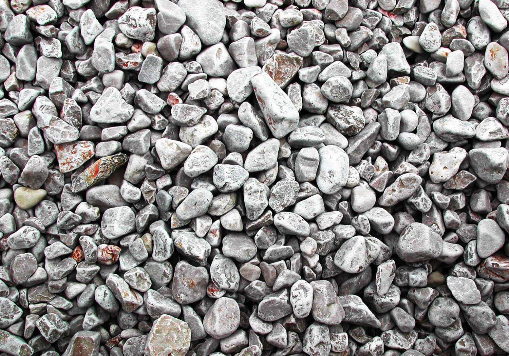
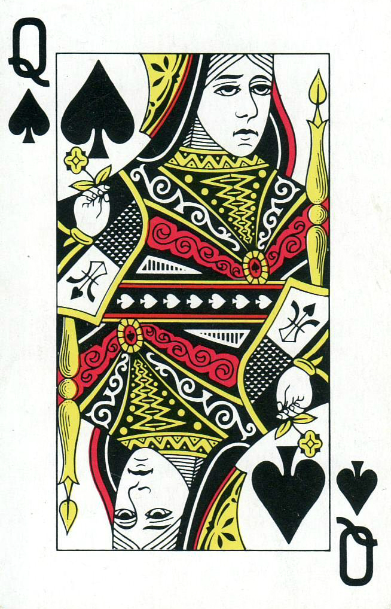

# APPlica-te

## About APPlica-te

APPlica-te is a VR + AR prototype game designed for children that frequent Elementary school. This is a game mainly for kids with some difficulties in maths but even adults can use it for fun. The game is all about interaction witch make it a perfect game for children to pick up interest for maths. 
APPlica-te is just a prototype game and so it only has on level yet althouth we make it extensive to make the application usable. To complete the game you have to complete all the 30 questions witch for now are just basic basic operations questions.

## Building the Project

So far the application was only developed in Android and so we didn't upload it to Play Store. 
To run the application, the project has to be opened in Unity and built into you're andriod smartphone. Make sure you have Vuforia package imported and added to Virtual Reality SDKs in Edit -> Project Settings -> Player -> XR Settings. 
Some other configurations you can take into account is to use Android 4.4 Kit Kat as Minimum API Level and uncheck Android TV Compatibility in Player -> Other Settings.

## How to play APPlica-te

At this point we will assume that you already have the application built and ready to run on your andriod phone.
The first step is to download the images below. They will be needed as targets to trigger the Aumented Reality in the application. The Menu target image is placed on the ground to be used as a target to trigger the menu inside the game and the Cursor target is placed in the 

Menu target             |  Cursor target
:-------------------------:|:-------------------------:
  |  

